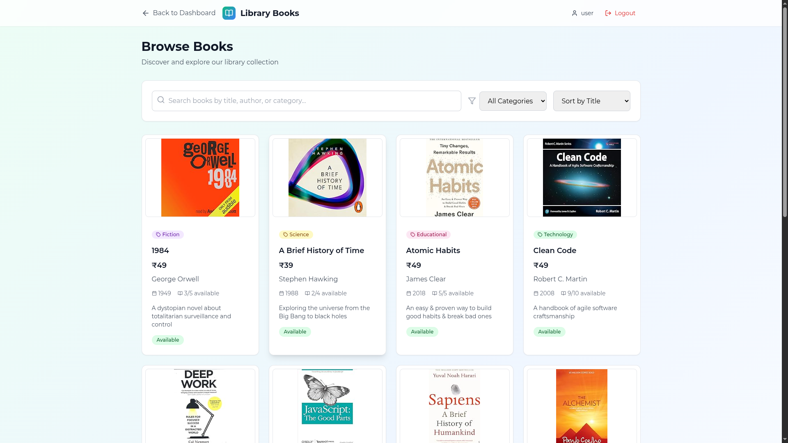
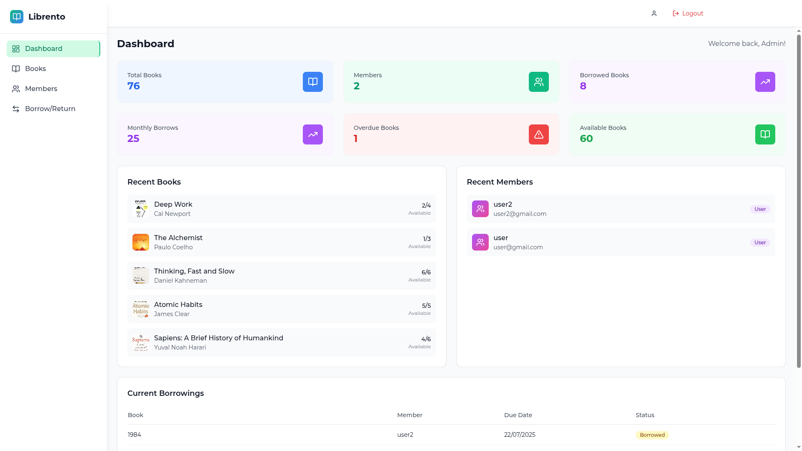
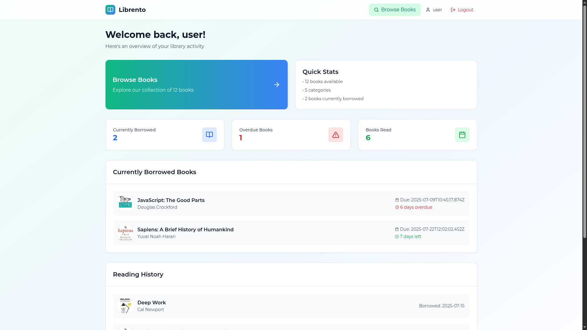
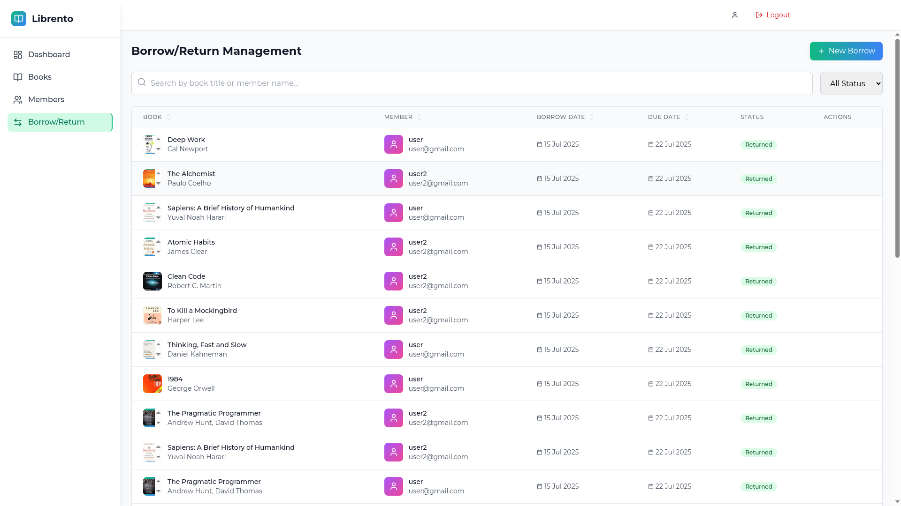

# 📚 Librento – Library Management System (Frontend)

A clean and intuitive frontend interface for Librento – a modern, full-featured Library Management System designed to handle books, members, borrow/return records, and analytics.

Built with **React**, **Redux**, and **Tailwind CSS**.

---

## 🚀 Live Demo

👉 [View Live App](https://librento.vercel.app/)  
👉 [Backend Repo](https://github.com/swastikpratik-bit/Librento_server)

---

## 🖼️ Screenshots

|  |  |  |  

---

## 🛠️ Tech Stack

- ⚛️ React
- 🌐 React Router
- 🗃️ Redux Toolkit
- 💅 Tailwind CSS
- 🔒 Axios with cookie-based authentication

---

## 📦 Project Structure

```
src/
├── assets/          # Static assets like logos, images
├── components/      # Reusable UI components (Modal, Table, etc.)
├── pages/           # Dashboard, Members, Borrow/Return, etc.
├── context/         # LibraryContext for global non-Redux state
├── layout/
├── store/           # Redux slices and logic
├── utils/
├── App.jsx
├── main.jsx
└── index.css
```

---

## 🧪 Features

- 🔐 User login/logout (with cookie-based auth)
- 📚 Book listing, search, filter
- 👥 Member management with add/edit
- 🔄 Borrow and return tracking
- 📊 Dashboard with real-time stats
- ⚡ Fully responsive and fast UI

---

## 🔧 Getting Started

### 1. Clone the repo

```bash
git clone https://github.com/swastikpratik-bit/Librento_client.git
cd librento-frontend
```

### 2. Install dependencies

```bash
npm install
```

### 3. Setup environment variables

Create a `.env` file in the root:

```
VITE_SERVER=https://your-backend-api.com
```

### 4. Start the dev server

```bash
npm run dev
```

---

## 🛠️ Available Scripts

- `npm run dev` – Runs the app in development mode.
- `npm run build` – Builds the app for production.
- `npm run preview` – Previews the production build.

---

## 🤝 Contribution Guidelines

1. Fork the repo.
2. Create a new branch: `git checkout -b feature/your-feature`.
3. Commit your changes.
4. Push to the branch: `git push origin feature/your-feature`.
5. Create a Pull Request.

---

## 🙋‍♂️ Contact

If you have any feedback, feature requests, or questions:

- 📧 Email: swastiksingh368@gmail.com

---

### 🌟 Star this repo to support the project!
